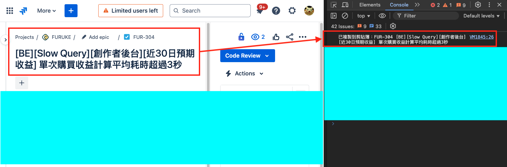
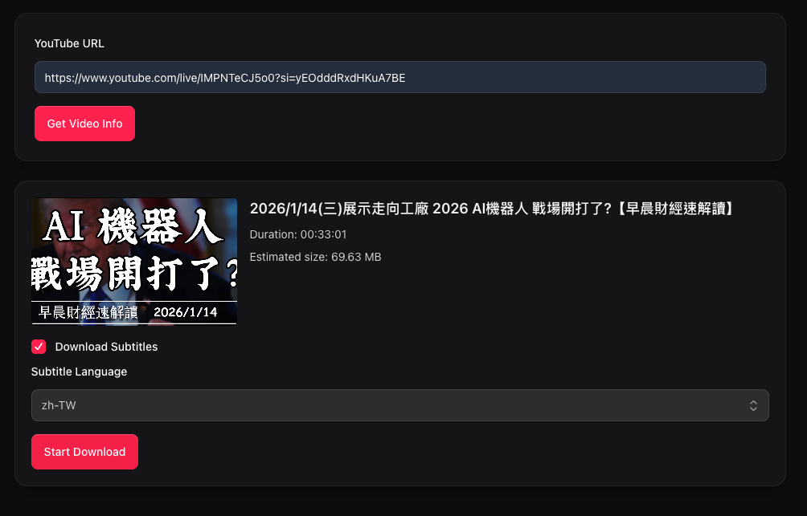
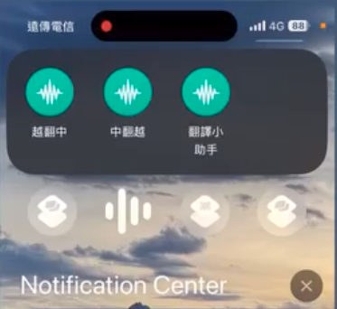
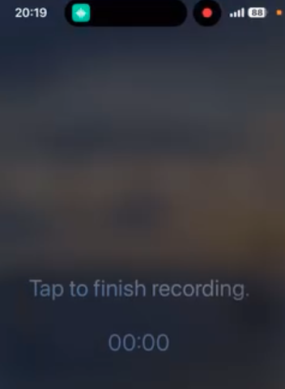
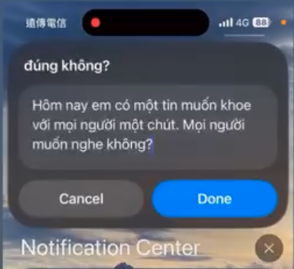
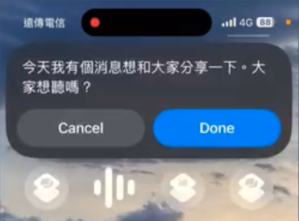
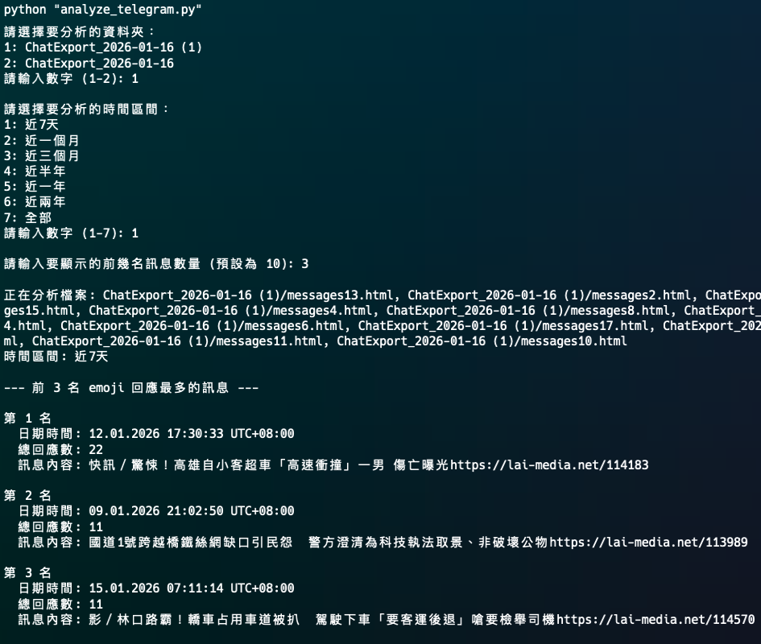

剛好最近在求職，公司要求要展示一些 AI 相關的經驗，所以就整理了幾個搭配 AI 做的 Side Project，跟大家分享 XD

---

## **Jira 複製工具（Chrome Extension）— 把「例行文書」變成一鍵完成**

### 問題

我們公司開發人員在開 Merge Request 時，需要固定格式的描述內容，但每次都要手動複製與調整，耗時也容易漏填。

### 我做了什麼

我用 AI 協作快速開發了一個 Chrome Extension：

- 自動從 Jira 畫面抓取資訊

- 生成符合團隊習慣的 MR 文字模板

- 直接複製到剪貼板，工程師不用再手動整理

### 成果

- 減少每次開 MR 的重複工作與格式錯誤

- 把「低價值但必要」的流程，轉成可重複使用的工具

- 讓團隊把時間回到更重要的開發與決策上

---

## **YouTube 下載器（Web App）— 用 AI 快速做出能上線的產品雛形**

### 問題

市面上的 YouTube Downloader 常見痛點是：

- 下載品質不穩定（無法拿到最高畫質）

- 很多工具無法同時取得字幕檔

### 我做了什麼

我用 AI 協作完成一個 Web App：

- 使用者貼上影片網址

- 直接下載該影片的「最高畫質」版本

- 同時支援字幕檔下載

---

## AI 翻譯 Shortcut（Apple Shortcut + API 串接）— 把 AI 變成隨身外骨骼

### 問題

我在越南旅遊時，希望能更自然地跟當地人交流，但 Google 翻譯常出現語氣不自然、詞不達意的狀況；而且在移動中打字很不方便。

### 我做了什麼

我用 AI 串接做了一個 Apple Shortcut，流程如下：

1. 選擇翻譯方向（中→越 / 越→中）

   

2. 錄音輸入

   

3. Speech-to-Text：把口語轉文字（Scribe API）

   

4. 丟給 LLM(ChatGPT API) 做更像「真人講話」的翻譯

5. 顯示翻譯結果，或用系統朗讀唸出來

   

### 延伸

在完成翻譯工具後，我把同一套語音輸入流程延伸成：

- **鍵盤工具**：講完直接轉成文字 → 放入剪貼簿

- **Flash Note**：講完直接整理成筆記 → 寫入 Apple Notes

---

## Telegram 貼文熱點分析工具（Python）— 讓資訊探索不再靠直覺滑到死

### 問題

我有時候想快速找出某個 Telegram Channel/群組裡：「互動最高 / 表情符號最多」的貼文是哪幾篇，來理解社群熱點與討論風向，但靠手動搜尋非常低效。

### 我做了什麼

我用 AI 協作寫了一個 Python 工具：

- Export Channel 資料後直接執行

- 自動統計 Emoji / 互動量

- 產出排行結果，快速定位熱點貼文

### 成果

把原本需要大量時間翻找的流程，變成一次分析就能得到答案。

---

## 用 AI 讓我的部落格支援「語音發文」（內容產出流程自動化）

### 問題

我想在任何時候都能快速記錄想法並發到部落格，但傳統流程需要：
坐在電腦前 → 打字 → 排版 → commit → 開 MR → 發佈\
導致我很多想法最後沒有被產出。

### 我做了什麼

我把 AI 加進我的內容工作流：

- 我只要用語音輸入講想法

- AI 協助整理成可發布的文章（支援雙語）

- 產生 Merge Request

- 我只需要在發布前快速審閱與 Approve

可參考文章：


### 成果

我成功把「寫作」從一件高成本的任務，變成低摩擦、可持續的日常輸出流程。
